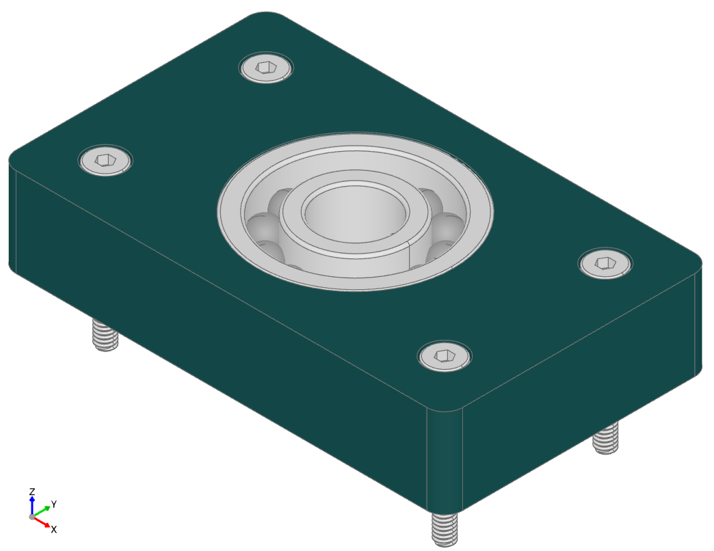

########################################
fastener - parametric threaded fasteners
########################################
Many mechanical designs will contain threaded fasteners of some kind, either in a
threaded hole or threaded screws or bolts holding two or more parts together. The
fastener sub-package provides a set of classes that
create many different types of nuts, screws and washers - as follows:

.. py:module:: fastener

.. image:: assets/fastener_disc.png
	:alt: fastener_disc

Here is a list of the classes (and fastener types) provided:

* :class:`Nut` - the base nut class

  * :class:`DomedCapNut` : din1587
  * :class:`HeatSetNut` : McMaster-Carr, Hilitchi
  * :class:`HexNut` : iso4033, iso4035, iso4032
  * :class:`HexNutWithFlange` : din1665
  * :class:`UnchamferedHexagonNut` : iso4036
  * :class:`SquareNut` : din557

* :class:`Screw` - the base screw class

  * :class:`ButtonHeadScrew` : iso7380_1
  * :class:`ButtonHeadWithCollarScrew` : iso7380_2
  * :class:`CheeseHeadScrew` : iso14580, iso7048, iso1207
  * :class:`CounterSunkScrew` : iso2009, iso14582, iso14581, iso10642, iso7046
  * :class:`HexHeadScrew` : iso4017, din931, iso4014
  * :class:`HexHeadWithFlangeScrew` : din1662, din1665
  * :class:`PanHeadScrew` : asme_b_18.6.3, iso1580, iso14583
  * :class:`PanHeadWithCollarScrew` : din967
  * :class:`RaisedCheeseHeadScrew` : iso7045
  * :class:`RaisedCounterSunkOvalHeadScrew` : iso2010, iso7047, iso14584
  * :class:`SetScrew` : iso4026
  * :class:`SocketHeadCapScrew` : iso4762, asme_b18.3

* :class:`Washer` - the base washer class

  * :class:`PlainWasher` : iso7094, iso7093, iso7089, iso7091
  * :class:`ChamferedWasher` : iso7090
  * :class:`CheeseHeadWasher` : iso7092

See :ref:`Extending the fastener sub-package <extending>` for guidance on how to easily
add new sizes or entirely new types of fasteners.

 The following example creates a variety of different sized fasteners:

.. code-block:: python

	from build123d import *
	from bd_warehouse.fastener import HexNut, SocketHeadCapScrew, SetScrew

	nut = HexNut(size="M3-0.5", fastener_type="iso4032")
	setscrew = SetScrew(size="M6-1", fastener_type="iso4026",length=10 * MM)
	capscrew = SocketHeadCapScrew(size="#6-32", fastener_type="asme_b18.3", length=(1/2) * IN)

Both metric and imperial sized standard fasteners are directly supported by the fastener sub-package
although the majority of the fasteners currently implemented are metric.

Many of the fastener standards provide ranges for some of the dimensions - for example a minimum and
maximum head diameter. This sub-package generally uses the maximum sizes when a range is available
in-order to ensure clearance between a fastener and another part won't be compromised by a physical
part that is within specification but larger than the CAD model.

Threaded parts are complex for CAD systems to create and significantly increase the storage requirements
thus making the system slow and difficult to use. To minimize these requirements all of the fastener
classes have a ``simple`` boolean parameter that when ``True`` doesn't create actual threads at all.
Such simple parts have the same overall dimensions and such that they can be used to check for fitment
without dramatically impacting performance.

All of the fasteners default to right-handed thread but each of them provide a ``hand`` string
parameter which can either be ``"right"`` or ``"left"``.

The following sections describe each of the provided classes.

.. _nut:

***
Nut
***
As the base class of all other nut and bolt classes, all of the derived nut classes share the same
interface as follows:

.. autoclass:: fastener.Nut
	:members: types, sizes, select_by_size, hole_locations, info, nut_thickness

..	:exclude-members: clearance_hole_data, clearance_hole_drill_sizes, tap_hole_data, tap_hole_drill_sizes, make_head, countersink_profile, default_countersink_profile, fastener_data

Nut Selection
=============
As there are many classes and types of nuts to select from, the Nut class provides some methods
that can help find the correct nut for your application. As a reminder, to find the subclasses of
the Nut class, use :class:`__subclasses__()`:

.. doctest::

   	>>> Nut.__subclasses__()
	[<class 'bd_warehouse.fastener.DomedCapNut'>, ...]

.. Here is a summary of the class methods:

.. .. automethod:: Nut.types

.. doctest::

	>>> HexNut.types()
	{'iso4033', 'iso4032', 'iso4035'}

.. .. automethod:: Nut.sizes

.. doctest::

	>>> HexNut.sizes("iso4033")
	['M1.6-0.35', 'M1.8-0.35', 'M2-0.4', 'M2.5-0.45', 'M3-0.45', 'M3.5-0.6', 'M4-0.7', 'M5-0.8', 'M6-1', 'M8-1.25', 'M10-1.5', 'M12-1.75', 'M14-2', 'M16-2', 'M18-2.5', 'M20-2.5', 'M22-2.5', 'M24-3', 'M27-3', 'M30-3.5', 'M33-3.5', 'M36-4', 'M39-4', 'M42-4.5', 'M45-4.5', 'M48-5', 'M52-5']

.. .. automethod:: Nut.select_by_size

.. doctest::

	>>> Nut.select_by_size("M6-1")
	{<class 'bd_warehouse.fastener.DomedCapNut'>: ['din1587'], <class 'bd_warehouse.fastener.HexNut'>: ['iso4035', 'iso4032', 'iso4033'], <class 'bd_warehouse.fastener.HexNutWithFlange'>: ['din1665'], <class 'bd_warehouse.fastener.UnchamferedHexagonNut'>: ['iso4036'], <class 'bd_warehouse.fastener.SquareNut'>: ['din557']}

Derived Nut Classes
===================
The following is a list of the current nut classes derived from the base Nut class. Also listed is
the type for each of these derived classes where the type refers to a standard that defines the nut
parameters. All derived nuts inherit the same API as the base Nut class.

.. * :class:`BradTeeNut` : Hilitchi

* :class:`DomedCapNut` : din1587
* :class:`HeatSetNut` : McMaster-Carr, Hilitchi
* :class:`HexNut` : iso4033, iso4035, iso4032
* :class:`HexNutWithFlange` : din1665
* :class:`UnchamferedHexagonNut` : iso4036
* :class:`SquareNut` : din557

Detailed information about any of the nut types can be readily found on the internet from manufacture's
websites or from the standard document itself.

.. 
	The :class:`BradTeeNut` is a compound object that uses multiple :class:`CounterSunkScrew` to fix the
	nut to the base object.  The size of these brads is stored in the :class:`nut_data` instance variable and
	can be used to place the brads as shown in the
	`brad_tee_and_heatset_nuts.py <https://github.com/gumyr/bd_warehouse/blob/main/examples/brad_tee_and_heatset_nuts.py>`_
	example.

..
	.. literalinclude:: ../examples/brad_tee_and_heatset_nuts.py
	:language: python

..
	.. doctest::

..
		{'BradTeeNut(Hilitchi): M8-1.25': 1, 'HeatSetNut(McMaster-Carr): M4-0.7': 3, 'CounterSunkScrew(iso10642): M4-0.7x20': 3}
		['M2-0.4-Short', 'M2-0.4-Standard', 'M3-0.5-Short', 'M3-0.5-Standard', 'M4-0.7-Short', 'M4-0.7-Standard', 'M5-0.8-Short', 'M5-0.8-Standard']

..
	.. image:: assets/brad_tee_nut_assembly.png

Note that a :class:`HeatSetNut` can only be placed with an :class:`InsertHole`
(see the :ref:`Custom Holes <custom holes>` section of more information). Also note that
the size of a :class:`HeatSetNut` includes a length component like "-Standard" or "-Short" but this depends
on the type.  Use the sizes method to see the valid values.

.. doctest::

	>>> HeatSetNut.sizes("McMaster-Carr")
	['M2-0.4-Short', 'M2-0.4-Standard', 'M3-0.5-Short', 'M3-0.5-Standard', 'M4-0.7-Short', 'M4-0.7-Standard', 'M5-0.8-Short', 'M5-0.8-Standard']

.. _screw:

*****
Screw
*****
As the base class of all other screw and bolt classes, all of the derived screw classes share the same
interface as follows:

.. autoclass:: fastener.Screw
	:exclude-members: clearance_hole_data, clearance_hole_drill_sizes, tap_hole_data, tap_hole_drill_sizes, nominal_length_range, make_head, countersink_profile, default_countersink_profile, fastener_data

The following method helps with hole creation:

.. .. automethod:: Screw.min_hole_depth

Screw Selection
===============
As there are many classes and types of screws to select from, the Screw class provides some methods that
can help find the correct screw for your application. As a reminder, to find the subclasses of the
Screw class, use :class:`__subclasses__()`:

.. doctest::

   	>>> Screw.__subclasses__()
	[<class 'bd_warehouse.fastener.ButtonHeadScrew'>, ...]

.. Here is a summary of the class methods:

.. .. automethod:: Screw.types

.. doctest::

	>>> CounterSunkScrew.types()
	{'iso14582', 'iso10642', 'iso14581', 'iso2009', 'iso7046'}

.. .. automethod:: Screw.sizes

.. doctest::

	>>> CounterSunkScrew.sizes("iso7046")
	['M1.6-0.35', 'M2-0.4', 'M2.5-0.45', 'M3-0.5', 'M3.5-0.6', 'M4-0.7', 'M5-0.8', 'M6-1', 'M8-1.25', 'M10-1.5']

.. .. automethod:: Screw.select_by_size

* :class:`select_by_size(size:str)` : (dict{class:[type,...],} - e.g.:

.. doctest::

	>>> Screw.select_by_size("M6-1")
	{<class 'bd_warehouse.fastener.ButtonHeadScrew'>: ['iso7380_1'], <class 'bd_warehouse.fastener.ButtonHeadWithCollarScrew'>: ['iso7380_2'], ...}

To see if a given screw type has screws in the length you are looking for, each screw class
provides a dictionary of available lengths, as follows:

.. doctest::

	>>> CounterSunkScrew.nominal_length_range["iso7046"]
	[3.0, 4.0, 5.0, 6.0, 8.0, 10.0, 12.0, 14.0, 16.0, 20.0, 25.0, 30.0, 35.0, 40.0, 45.0, 50.0, 55.0, 60.0]

During instantiation of a screw any value of :class:`length` may be used; however, only a subset of
the above nominal_length_range is valid for any given screw size. The valid sub-range is given
with the :class:`nominal_lengths` property as follows:

.. doctest::

	>>> screw = CounterSunkScrew(fastener_type="iso7046",size="M6-1",length=12 * MM)
	>>> screw.nominal_lengths
	[8.0, 10.0, 12.0, 14.0, 16.0, 20.0, 25.0, 30.0, 35.0, 40.0, 45.0, 50.0, 55.0, 60.0]

Derived Screw Classes
=====================
The following is a list of the current screw classes derived from the base Screw class. Also listed
is the type for each of these derived classes where the type refers to a standard that defines the
screw parameters. All derived screws inherit the same API as the base Screw class.

* :class:`ButtonHeadScrew` : iso7380_1
* :class:`ButtonHeadWithCollarScrew` : iso7380_2
* :class:`CheeseHeadScrew` : iso14580, iso7048, iso1207
* :class:`CounterSunkScrew` : iso2009, iso14582, iso14581, iso10642, iso7046
* :class:`HexHeadScrew` : iso4017, din931, iso4014
* :class:`HexHeadWithFlangeScrew` : din1662, din1665
* :class:`PanHeadScrew` : asme_b_18.6.3, iso1580, iso14583
* :class:`PanHeadWithCollarScrew` : din967
* :class:`RaisedCheeseHeadScrew` : iso7045
* :class:`RaisedCounterSunkOvalHeadScrew` : iso2010, iso7047, iso14584
* :class:`SetScrew` : iso4026
* :class:`SocketHeadCapScrew` : iso4762, asme_b18.3

Detailed information about any of the screw types can be readily found on the internet from manufacture's
websites or from the standard document itself.

.. _washer:

******
Washer
******
As the base class of all other washer and bolt classes, all of the derived washer classes share
the same interface as follows:

.. autoclass:: Washer
	:members: types, sizes

..	:exclude-members: clearance_hole_data, clearance_hole_drill_sizes, tap_hole_data, tap_hole_drill_sizes, nominal_length_range, make_head, countersink_profile, default_countersink_profile, default_washer_profile, fastener_data

Washer Selection
================
As there are many classes and types of washers to select from, the Washer class provides some methods
that can help find the correct washer for your application. As a reminder, to find the subclasses of
the Washer class, use :class:`__subclasses__()`:

.. doctest::

	>>> Washer.__subclasses__()
	[<class 'bd_warehouse.fastener.PlainWasher'>, <class 'bd_warehouse.fastener.ChamferedWasher'>, <class 'bd_warehouse.fastener.CheeseHeadWasher'>]

Here is a summary of the class methods:

.. .. automethod:: Washer.types

.. doctest::

	>>> PlainWasher.types()
	{'iso7091', 'iso7089', 'iso7093', 'iso7094'}

.. .. automethod:: Washer.sizes

.. doctest::

	>>> PlainWasher.sizes("iso7091")
	['M1.6', 'M1.7', 'M2', 'M2.3', 'M2.5', 'M2.6', 'M3', 'M3.5', 'M4', 'M5', 'M6', 'M7', 'M8', 'M10', 'M12', 'M14', 'M16', 'M18', 'M20', 'M22', 'M24', 'M26', 'M27', 'M28', 'M30', 'M32', 'M33', 'M35', 'M36']

.. .. automethod:: Washer.select_by_size

.. doctest::

	>>> Washer.select_by_size("M6")
	{<class 'bd_warehouse.fastener.PlainWasher'>: ['iso7094', 'iso7093', 'iso7089', 'iso7091'], <class 'bd_warehouse.fastener.ChamferedWasher'>: ['iso7090'], <class 'bd_warehouse.fastener.CheeseHeadWasher'>: ['iso7092']}

Derived Washer Classes
======================
The following is a list of the current washer classes derived from the base Washer class. Also listed
is the type for each of these derived classes where the type refers to a standard that defines the washer
parameters. All derived washers inherit the same API as the base Washer class.

* :class:`PlainWasher` : iso7094, iso7093, iso7089, iso7091
* :class:`ChamferedWasher` : iso7090
* :class:`CheeseHeadWasher` : iso7092

Detailed information about any of the washer types can be readily found on the internet from manufacture's
websites or from the standard document itself.

.. _custom holes:

************
Custom Holes
************
When designing parts with build123d a common operation is to place holes appropriate to a specific fastener
into the part. This operation is optimized with bd_warehouse by the following four custom hole objects:

.. autoclass:: fastener.ClearanceHole
.. autoclass:: fastener.InsertHole
.. autoclass:: fastener.TapHole
.. autoclass:: fastener.ThreadedHole

The APIs for these holes are very similar. The ``fit`` parameter is used
for clearance hole dimensions and to calculate the gap around the head of a countersunk screw.
The ``material`` parameter controls the size of the tap hole as they differ as a function of the
material the part is made of. For clearance and tap holes, ``depth`` values of ``None`` are treated
as thru holes. The threaded hole method requires that ``depth`` be specified as a consequence of
how the thread is constructed.

These methods use data provided by a fastener instance (either a :class:`Nut` or a :class:`Screw`) to both create
the appropriate hole (possibly countersunk) in your part as well as add the location of the holes to
the fastener's ``hole_locations`` attribute to ease the creation of assemblies with both the
base parts and fasteners.

For example, let's build the parametric bearing pillow block:

.. literalinclude:: ../examples/pillow_block.py

Which results in:

Note the following benefits:

* screw and bearing dimensions aren't required, 
* the screw is created during instantiation of the :class:`SocketHeadCapScrew` class
  without the user knowing any of its dimensions, 
* the :class:`ClearanceHole` object only requires the fastener thus the user need
  not provide hole dimensions.
* the assembly contains both the part and copies of the fastener thus avoiding the 
  overhead of many fasteners in the design.

Not only were the appropriate holes for the bearing and M2-0.4 screws created but an assembly was created to
store all of the parts in this project all without having to research the dimensions of the parts.

Note: In this example the ``simple=False`` parameter creates accurate threads on each of the
screws which significantly increases the complexity of the model. The default of simple is True
which models the thread as a simple cylinder which is sufficient for most applications without
the performance cost of accurate threads.

The data used in the creation of these holes is available via three instance methods:

.. doctest::

	>>> screw = CounterSunkScrew(fastener_type="iso7046", size="M6-1", length=10)
	>>> screw.clearance_hole_diameters
	{'Close': 6.4, 'Normal': 6.6, 'Loose': 7.0}

	>>> screw.clearance_drill_sizes
	{'Close': '6.4', 'Normal': '6.6', 'Loose': '7'}
	>>> screw.tap_hole_diameters
	{'Soft': 5.0, 'Hard': 5.4}
	>>> screw.tap_drill_sizes
	{'Soft': '5', 'Hard': '5.4'}

Note that with imperial sized holes (e.g. 7/16), the drill sizes could be a fractional size (e.g. 25/64)
or a numbered or lettered size (e.g. U). 

Screw and Hole Alignment
========================
If a ``depth`` parameter is provided to the hole methods when placing a screw, the screw will
be located in the provided assembly such that the tip of the screw to bottom out in the hole.
This may result in the screw extending above the top surface. For example:

.. literalinclude:: ../examples/screw_at_depth.py

Which results in:

.. image:: assets/screw_at_depth.png
	:alt: screw_at_depth

If no :class:`depth` is provided, the hole will extend through the part and the screw will be
aligned with the surface.

Captive Nuts
============

The :class:`ClearanceHole` method has a ``captive_nut`` parameter that
when used with a hex or square nut will create a hole that captures the nut such that it
can't spin.  Here is an example:

.. literalinclude:: ../examples/captive_nuts.py

Which results in:

.. image:: assets/captive_nuts.png
	:alt: captive_nuts

The space around the nuts is controlled by the ``fit`` parameter.

******************
Fastener Locations
******************
There are two methods that assist with the location of fastener holes relative to other
parts: :meth:`~extensions_doc.Assembly.fastenerLocations` and :meth:`~extensions_doc.Workplane.pushFastenerLocations`.

To aid in the alignment of fasteners :meth:`~extensions_doc.Assembly.fastenerLocations` scans
the provided Assembly for the given fastener and pushes the Location values onto the build123d
Workplane stack. This method provides ``fastener.offset`` and ``flip`` options which modify the existing
fastener locations to allow for a fastener to be positioned on the back side of a structure as
shown in the `bolt_plates_together.py <https://github.com/gumyr/bd_warehouse/blob/main/examples/bolt_plates_together.py>`_
example.

.. literalinclude:: ../examples/bolt_plates_together.py
   :language: python

.. doctest::

	{'HexNutWithFlange(din1665): M6-1': 1, 'HexHeadScrew(iso4014): M6-1x20': 1, 'PlainWasher(iso7093): M6': 1}

.. image:: assets/bolting_plates.png

In more complex situations many Assemblies may be nested together. To cope with this, the Locations
are relative to the Assembly provided and shown in the
`align_fastener_holes.py <https://github.com/gumyr/bd_warehouse/blob/main/examples/align_fastener_holes.py>`_
example.

.. literalinclude:: ../examples/align_fastener_holes.py
   :language: python

.. doctest::

	((25.0, 5.0, 12.0), (0.0, -0.0, 0.0))
	((15.0, 5.0, 12.0), (0.0, -0.0, 0.0))
	((20.0, 12.0, 5.0), (1.5707963267948966, -0.0, 3.141592653589793))
	{'SocketHeadCapScrew(iso4762): M2-0.4x6': 3}

.. image:: assets/fastenerLocations.png

.. _extending:

**********************************
Extending the fastener sub-package
**********************************
The fastener sub-package has been designed to be extended in the following two ways:

Alternate Sizes
===============
As mentioned previously, the data used to guide the creation of fastener objects is derived
from :class:`.csv` files found in the same place as the source code. One can add to the set of standard
sized fasteners by inserting appropriate data into the tables. There is a table for each fastener
class; an example of the 'socket_head_cap_parameters.csv' is below:

+------------+------------+-----------+-----+---------------+--------------+-----+--------------+
| Size       | iso4762:dk | iso4762:k | ... | asme_b18.3:dk | asme_b18.3:k |     | asme_b18.3:s |
+============+============+===========+=====+===============+==============+=====+==============+
| M2-0.4     | 3.98       | 2         |     |               |              |     |              |
+------------+------------+-----------+-----+---------------+--------------+-----+--------------+
| M2.5-0.45  | 4.68       | 2.5       |     | 0.096         | 0.06         |     | 0.05         |
+------------+------------+-----------+-----+---------------+--------------+-----+--------------+
| M3-0.5     | 5.68       | 3         |     | 0.118         | 0.073        |     | 1/16         |
+------------+------------+-----------+-----+---------------+--------------+-----+--------------+
| ...        |            |           |     | 0.118         | 0.073        |     | 1/16         |
+------------+------------+-----------+-----+---------------+--------------+-----+--------------+
| #0-80      |            |           |     | 0.14          | 0.086        |     | 5/64         |
+------------+------------+-----------+-----+---------------+--------------+-----+--------------+
| #1-64      |            |           |     |               |              |     |              |
+------------+------------+-----------+-----+---------------+--------------+-----+--------------+
| #1-72      |            |           |     |               |              |     |              |
+------------+------------+-----------+-----+---------------+--------------+-----+--------------+
| #2-56      |            |           |     |               |              |     |              |
+------------+------------+-----------+-----+---------------+--------------+-----+--------------+

The first row must contain a 'Size' and a set of '{fastener_type}:{parameter}'
values. The parameters are taken from the ISO standards where 'k' represents the
head height of a screw head, 'dk' is represents the head diameter, etc. Refer to
the appropriate document for a complete description. The fastener 'Size' field
has the format 'M{thread major diameter}-{thread pitch}' for metric fasteners or
either '#{guage}-{TPI}' or '{fractional major diameter}-{TPI}' for imperial
fasteners (TPI refers to Threads Per Inch). All the data for imperial fasteners
must be entered as inch dimensions while metric data is in millimeters.

There is also a 'nominal_screw_lengths.csv' file that contains a list of all the
lengths supported by the standard, as follows:

+------------+------+--------------------------+
| Screw_Type | Unit | Nominal_Sizes            |
+============+======+==========================+
| din931     | mm   | 30,35,40,45,50,55,60,... |
+------------+------+--------------------------+
| ...        |      |                          |
+------------+------+--------------------------+

The 'short' and 'long' values from the first table (not shown) control the
minimum and maximum values in the nominal length ranges for each screw.

New Fastener Types
==================
The base/derived class structure was designed to allow the creation of new
fastener types/classes. For new fastener classes a 2D drawing of one half of the
fastener profile is required. If the fastener has a non circular plan (e.g. a
hex or a square) a 2D drawing of the plan is required. If the fastener contains
a flange and a plan, a 2D profile of the flange is required. If these profiles
or plans are present, the base class will use them to build the fastener. The
Abstract Base Class technology ensures derived classes can't be created with
missing components.

*********
Reference
*********

.. autoclass:: DomedCapNut
.. autoclass:: HeatSetNut
.. autoclass:: HexNut
.. autoclass:: HexNutWithFlange
.. autoclass:: UnchamferedHexagonNut
.. autoclass:: SquareNut
.. autoclass:: ButtonHeadScrew
.. autoclass:: ButtonHeadWithCollarScrew
.. autoclass:: CheeseHeadScrew
.. autoclass:: CounterSunkScrew
.. autoclass:: HexHeadScrew
.. autoclass:: HexHeadWithFlangeScrew
.. autoclass:: PanHeadScrew
.. autoclass:: PanHeadWithCollarScrew
.. autoclass:: RaisedCheeseHeadScrew
.. autoclass:: RaisedCounterSunkOvalHeadScrew
.. autoclass:: SetScrew
.. autoclass:: SocketHeadCapScrew
.. autoclass:: PlainWasher
.. autoclass:: ChamferedWasher
.. autoclass:: CheeseHeadWasher
