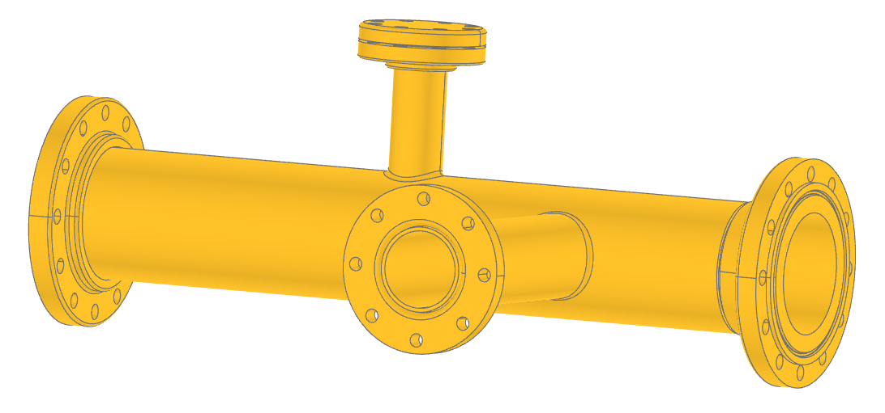
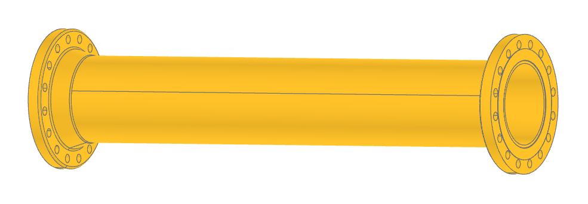

..
    bd_warehouse/flange

    by:   Gumyr
    date: June 12th 2023

    desc: This is the documentation for b3d_warehouse/flange.

    license:

        Copyright 2023 Gumyr

        Licensed under the Apache License, Version 2.0 (the "License");
        you may not use this file except in compliance with the License.
        You may obtain a copy of the License at

            http://www.apache.org/licenses/LICENSE-2.0

        Unless required by applicable law or agreed to in writing, software
        distributed under the License is distributed on an "AS IS" BASIS,
        WITHOUT WARRANTIES OR CONDITIONS OF ANY KIND, either express or implied.
        See the License for the specific language governing permissions and
        limitations under the License.

########################################
flange - standardized parametric flanges
########################################

.. highlight:: python

Flanges are mechanical components used in piping systems to connect pipes,
valves, and equipment. They provide a secure and leak-tight connection by
bolting two flange faces together. Flanges allow for easy assembly and
disassembly, enabling maintenance and modifications in the system. They are
available in various materials, sizes, and pressure ratings to suit different
applications. Flanges also provide flexibility by allowing different types of
connections, such as welding, threaded, or flanged connections. They play a
critical role in industries like oil and gas, chemical, and power generation,
ensuring the safe and efficient operation of piping systems by facilitating
proper alignment, support, and sealing of the connected components.

.. code-block:: python

  from build123d import *
  from bd_warehouse.flange import SlipOnFlange, WeldNeckFlange

  flange1 = SlipOnFlange(nps="8", flange_class=150)
  flange2 = WeldNeckFlange(nps="12", flange_class=300, face_type="Ring")

There are two required and one optional parameters used to define a flange: ``nps``, 
``flange_class``, and ``face_type``.

nps
---

See :ref:`Pipe NPS <nps>` for a description of the Nominal Pipe Size.

flange_class
------------

Flange class refers to the pressure-temperature rating assigned to a flange
based on its design and construction. It represents the maximum pressure and
temperature at which the flange can safely operate without failure. Flange
classes are defined by various standards, such as ASME B16.5 or API 6A, and are
typically identified by a numerical value (e.g., Class 150, Class 300, etc.).
Each flange class has specific requirements for materials, dimensions, and
performance, ensuring that the flange can withstand the specified pressure and
temperature conditions. Flange class selection is crucial for maintaining the
integrity and safety of a piping system by ensuring that the flange can handle
the intended service conditions.

.. py:module:: flange

.. autoclass:: FlangeClass

face_type
---------

The face of a flange refers to the surface where two flanges come into contact
with each other during the connection. There are several different types
of flange faces, each serving a specific purpose. These include:

* Flat Face (FF): The flange faces are flat and parallel to each other. It
  is typically used in low-pressure applications where leakage prevention
  is not a significant concern.
* Raised Face (RF): The flange faces have a raised portion around the
  perimeter. The raised face provides a compression seal when the flanges
  are bolted together, improving the sealing capability.
* Lap Joint (LJ): The flange faces have a flat surface, and a separate lap
  joint stub end is used between the flanges. It allows easy alignment and
  rotation of the flanges during assembly.
* Ring Type Joint (RTJ): The flange faces have grooves to accommodate a
  metallic ring gasket. It is commonly used in high-pressure and
  high-temperature applications, providing excellent sealing performance.
* Tongue and Groove: The flange faces have a tongue-like projection on one
  flange and a corresponding groove on the other flange. It ensures proper
  alignment and prevents movement or rotation between the flanges.

The selection of the flange face type depends on the specific application,
pressure, temperature, and sealing requirements of the piping system. Different
flange faces offer varying levels of sealing capability and ease of assembly,
allowing engineers and designers to choose the most suitable option for their
intended purpose.

.. autoclass:: FaceType

Joints
------

All flanges are created with two ``RigidJoint``: ``pipe`` and ``face``.  These joints 
are positioned in the center of the flange and oriented such that they can be easily
connected to pipes and each other. For example:

.. code-block:: python

    inlet_flange = WeldNeckFlange(nps="12", flange_class=300, face_type="Ring")
    outlet_flange = SlipOnFlange(nps="12", flange_class=300)
    pipe = Pipe(
        nps="12",
        material="steel",
        identifier="40",
        path=Edge.make_line((0, 0, 0), (6 * FT, 0, 0)),
    )

    pipe.joints["inlet"].connect_to(inlet_flange.joints["pipe"])
    pipe.joints["outlet"].connect_to(outlet_flange.joints["pipe"])

Flange Types
------------

.. autoclass:: BlindFlange
    :members:

.. autoclass:: SlipOnFlange
    :members:

.. autoclass:: SocketWeldFlange
    :members:

.. autoclass:: WeldNeckFlange
    :members:

Specifications
--------------

The flanges created by this package are based off the following standards:

  * ASME B16.5 is a standard issued by the American Society of Mechanical Engineers
    (ASME) that provides specifications for pipe flanges and flanged fittings. It
    covers a wide range of flange types, sizes, materials, and pressure ratings.
    ASME B16.5 establishes the dimensions, tolerances, and technical requirements
    for flanges used in various industries, including oil and gas, chemical, and
    power generation. The standard ensures the compatibility, integrity, and
    performance of flanged connections, facilitating proper alignment, sealing, and
    strength of the joint. It serves as a reference for manufacturers, engineers,
    and designers in the selection, design, and installation of flanges, promoting
    safe and reliable operation of piping systems.
