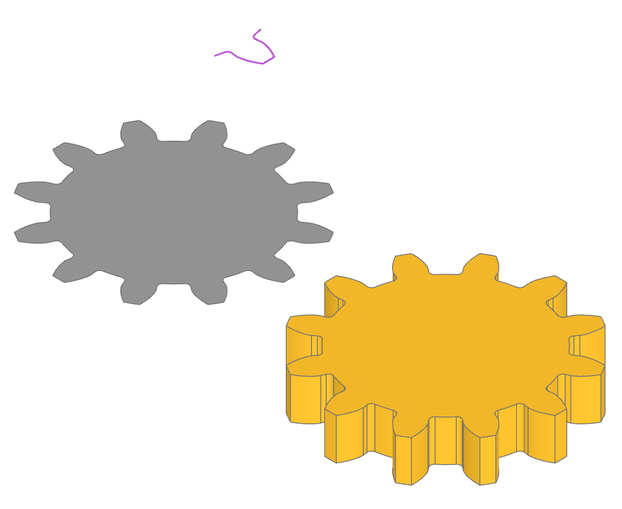

#######################
gear - parametric gears
#######################

This Python package enables the creation of a wide variety of standard ISO (metric) 
involute spur gears. Involute gears have the advantage of continually meshing at a 
specific angle, known as the pressure angle, which prevents the stuttering that can 
occur with non-involute gears when the teeth lose contact.

Application Example
===================

Imagine a telescope mount: involute gears allow the telescope to smoothly follow a star as 
it moves across the night sky, ensuring a steady image during long exposures. In contrast, 
non-involute gears might introduce vibrations that blur the image.

Ensuring Proper Gear Meshing
============================

Gears must mesh properly to function effectively. Here are the guidelines to ensure proper 
meshing:

Tooth Shape and Size Consistency:
---------------------------------
	Meshing gears must have the same tooth shape and size. Use a common module for metric 
	gears or a common diametral pitch value for imperial gears. For fully custom gears, 
	ensure that the base, pitch, and outer radii are calculated correctly.

Proper Gear Separation:
-----------------------
	When positioning two gears to mesh, they should be separated by the sum of their 
	pitch radii. The separation can be calculated easily:

		Multiply the gear module by the sum of the tooth count of both gears and divide by two.

		.. math::
			\text{separation} = \text{module} \cdot \frac{n_0 + n_1}{2} [mm]

Example Code
===================
.. code-block:: python

	from build123d import *
	from bd_warehouse.gear import InvoluteToothProfile, SpurGear, SpurGearPlan

	gear_tooth = InvoluteToothProfile(
		module=2,
		tooth_count=12,
		pressure_angle=14.5,
		root_fillet=0.5 * MM,
	)

	gear_profile = SpurGearPlan(
		module=2,
		tooth_count=12,
		pressure_angle=14.5,
		root_fillet=0.5 * MM,
	)

	spur_gear = SpurGear(
		module=2,
		tooth_count=12,
		pressure_angle=14.5,
		root_fillet=0.5 * MM,
		thickness=5 * MM,
	)

.. autoclass:: gear.InvoluteToothProfile
.. autoclass:: gear.SpurGearPlan
.. autoclass:: gear.SpurGear

