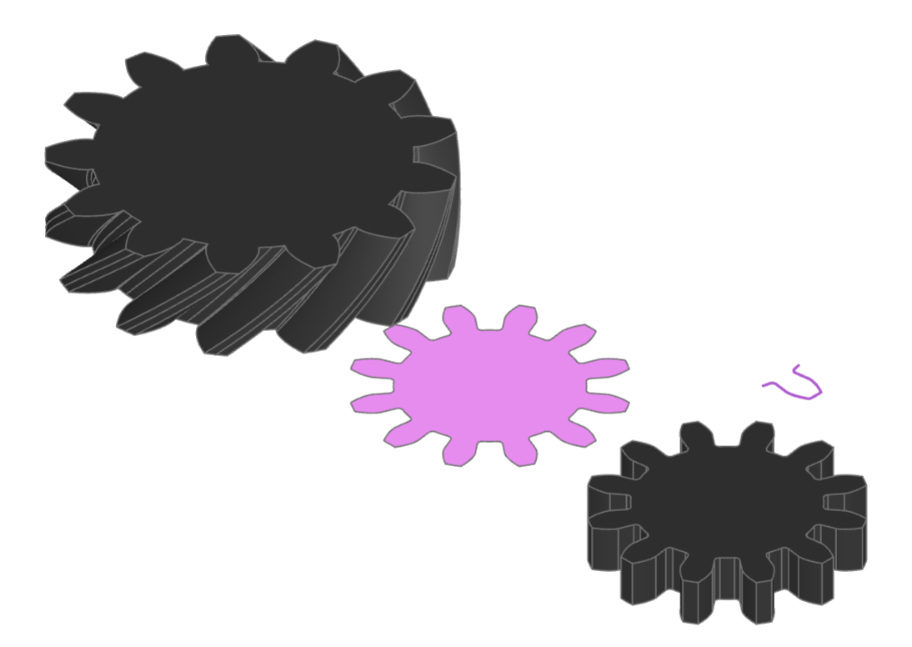

#######################
gear - parametric gears
#######################

This Python package enables the creation of a wide variety of standard ISO
metric-module involute spur, helical, rack and worm gears. Involute gears have the advantage
of continually meshing at a specific angle, known as the pressure angle, which
prevents the stuttering that can occur with non-involute gears when the teeth
lose contact.

Application Example
===================

Imagine a telescope mount: involute gears allow the telescope to smoothly follow a star as 
it moves across the night sky, ensuring a steady image during long exposures. In contrast, 
non-involute gears might introduce vibrations that blur the image.

Ensuring Proper Gear Meshing
============================

Gears must mesh properly to function effectively. Here are the guidelines to ensure proper 
meshing:

Tooth Shape and Size Consistency:
---------------------------------
	Meshing gears must have the same tooth shape and size. Use a common module
	and pressure angle. For fully custom gears, ensure that the base, pitch,
	and outer radii are calculated correctly.

Proper Gear Separation:
-----------------------
	When positioning two gears to mesh, they should be separated by the sum of their 
	pitch radii. The separation can be calculated easily:

		Multiply the gear module by the sum of the tooth count of both gears and divide by two.

		.. math::
			\text{separation} = \text{module} \cdot \frac{n_0 + n_1}{2} [mm]

Spur Gears
==========

``InvoluteToothProfile`` is the outline of a single involute tooth,
``SpurGearPlan`` repeats it into the complete 2D gear and ``SpurGear`` extrudes
the plan to a solid. All three share the same ``module``, ``tooth_count``,
``pressure_angle`` and optional ``root_fillet``, ``tip_fillet``, ``addendum`` and
``dedendum`` parameters, and expose the calculated ``pitch_radius``,
``base_radius``, ``addendum_radius`` and ``root_radius``. ``root_fillet`` rounds
the concave corners at the bottom of each tooth space and ``tip_fillet`` the two
convex corners at the top of each tooth. An internal gear can be made by
subtracting a ``SpurGearPlan`` from a larger circle; the roles of the two fillets
then swap, with ``tip_fillet`` rounding the internal gear's root and
``root_fillet`` its tooth tip.

.. code-block:: python

	from build123d import *
	from bd_warehouse.gear import HelicalGear, InvoluteToothProfile, SpurGear, SpurGearPlan

	gear_tooth = InvoluteToothProfile(
		module=2,
		tooth_count=12,
		pressure_angle=14.5,
		root_fillet=0.5 * MM,
	)

	gear_profile = SpurGearPlan(
		module=2,
		tooth_count=12,
		pressure_angle=14.5,
		root_fillet=0.5 * MM,
	)

	spur_gear = SpurGear(
		module=2,
		tooth_count=12,
		pressure_angle=14.5,
		root_fillet=0.5 * MM,
		thickness=5 * MM,
	)

Helical Gears
=============

``HelicalGear`` twists the spur gear plan through its thickness. Its ``module``
and ``pressure_angle`` can be given in either measurement plane, selected by
``module_system``: ``"normal"`` (perpendicular to the tooth helix, the cutting
tool convention) or ``"transverse"`` (perpendicular to the gear axis, which sets
the pitch diameter directly as ``module * tooth_count``). The two are related by
``transverse_module = normal_module / cos(helix_angle)``, and both values are
available as attributes whichever was given. A positive ``helix_angle`` is a
right-hand helix.

Parallel-axis helical gears mesh when they share the transverse module and
pressure angle and have equal and *opposite* helix angles. Crossed-axis pairs,
such as a worm and its wheel, use the *same* hand.

.. code-block:: python

	from bd_warehouse.gear import HelicalGear

	helical_gear = HelicalGear(
		module=2,
		tooth_count=13,
		pressure_angle=20,
		helix_angle=45,
		thickness=10 * MM,
	)

Rack Gears
==========

A rack is the infinite-radius limit of an involute gear, so each tooth flank is a
straight line at the transverse pressure angle. ``RackGearPlan`` is the 2D basic
rack profile of ``tooth_count`` trapezoidal teeth on a rectangular body of
``base_height``, with the pitch line on the X axis at Y = 0 and an exact pitch
length of ``tooth_count * pi * transverse_module``. ``RackGear`` extrudes the plan
to ``thickness``; a non-zero ``helix_angle`` skews the teeth linearly across the
face width to mesh with a helical pinion. Like ``HelicalGear``, rack dimensions
can be given in the ``"normal"`` or ``"transverse"`` system.

A rack meshes with a spur or helical gear of the same module and pressure angle
when its pitch line is one pitch radius from the gear axis.

.. code-block:: python

	from bd_warehouse.gear import RackGear, RackGearPlan

	rack_plan = RackGearPlan(module=2, tooth_count=10, pressure_angle=20)
	rack_gear = RackGear(
		module=2,
		tooth_count=10,
		pressure_angle=20,
		thickness=8 * MM,
		helix_angle=15,
	)

Worm Gears
==========

A worm drive pairs a screw-like *worm* with a *worm wheel* on shafts crossed at
90°, giving a large ratio (``tooth_count / starts``) in a compact package. The
worm is defined by ISO 54 / DIN 3975 parameters: the axial ``module`` (which
equals the wheel's transverse module), the number of ``starts`` (threads) and the
``diametral_quotient`` ``q = reference diameter / module``, from which the lead
angle follows as ``tan(γ) = starts / q``.

Two flank forms are provided. Both are exact ruled surfaces between helices of
the worm's lead, so ``WormFlank`` is a true helicoid rather than a swept
approximation:

* ``"ZI"`` (involute helicoid, the default) is the tangent developable of the
  base helix. Its transverse sections are circle involutes, making it the only
  form conjugate to an involute worm wheel.
* ``"ZA"`` (Archimedean helicoid) has straight flanks at the axial pressure angle
  in every axial section, like a trapezoidal thread.

``Worm`` assembles the flanks, the tip and root cylinders and the planar ends into
a single solid directly, without sweeps or boolean operations, so a worm takes
milliseconds to build and its transverse section matches the analytic tooth
profile. ``WormWheel`` is a ``HelicalGear`` with the matching transverse module,
helix angle equal to the worm lead angle and the same hand. ``WormGear``
positions both at the centre distance ``module * (q + tooth_count) / 2`` with a
thread space facing a wheel tooth.

.. code-block:: python

	from bd_warehouse.gear import Worm, WormGear, WormWheel

	worm = Worm(module=2, starts=2, diametral_quotient=10, length=30)
	wheel = WormWheel(module=2, tooth_count=30, thickness=12, starts=2, diametral_quotient=10)
	worm_gear = WormGear(
		module=2,
		starts=2,
		diametral_quotient=10,
		tooth_count=30,
		worm_length=30,
		wheel_thickness=12,
	)

This first version makes the following simplifications: the wheel is a plain
(non-throated) helical gear, tooth proportions are standard (addendum ``module``,
dedendum ``1.2 * module``) with no profile shift, backlash or fillets, the worm
ends are cut square, and the shaft angle is 90°.

.. autoclass:: gear.InvoluteToothProfile
.. autoclass:: gear.SpurGearPlan
.. autoclass:: gear.SpurGear

.. autoclass:: gear.HelicalGear

.. autoclass:: gear.RackGearPlan
.. autoclass:: gear.RackGear

.. autoclass:: gear.WormFlank
.. autoclass:: gear.Worm
.. autoclass:: gear.WormWheel
.. autoclass:: gear.WormGear
