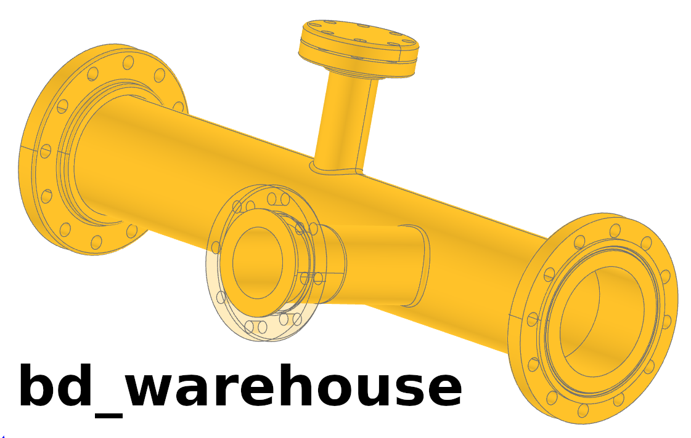

..
    bd_warehouse readthedocs documentation

    by:   Gumyr
    date: June 11th 2023

    desc: This is the documentation for bd_warehouse on readthedocs.

    license:

        Copyright 2023 Gumyr

        Licensed under the Apache License, Version 2.0 (the "License");
        you may not use this file except in compliance with the License.
        You may obtain a copy of the License at

            http://www.apache.org/licenses/LICENSE-2.0

        Unless required by applicable law or agreed to in writing, software
        distributed under the License is distributed on an "AS IS" BASIS,
        WITHOUT WARRANTIES OR CONDITIONS OF ANY KIND, either express or implied.
        See the License for the specific language governing permissions and
        limitations under the License.

.. highlight:: python

If you've ever wondered about finding a better alternative to proprietary
software for mechanical CAD, consider exploring 
`Build123d <https://build123d.readthedocs.io/en/latest/>`_, along with related
packages like **bd_warehouse** and `cq_gears <https://github.com/meadiode/cq_gears>`_. 
Build123d enhances the widely used Python programming language by adding powerful 
capabilities that enable the creation of various mechanical designs using the same 
techniques employed in today's technology.

By incorporating **bd_warehouse** into **Build123d**, you gain access to on-demand
generation of parametric parts and extensions that expand the core capabilities
of Build123d. These resulting parts can be seamlessly integrated into your
projects or saved as CAD files in formats such as STEP or STL. This allows for
compatibility with a wide range of CAD, CAM, and analytical systems.

With just a few lines of code, you can create parametric parts that are easily
reviewable and version controlled using tools like `git <https://git-scm.com/>`_ 
and `GitHub <https://github.com/>`_.
Documentation can be automatically generated from the source code of your
designs, similar to the documentation you're currently reading. Additionally,
comprehensive test suites can automatically validate parts, ensuring that no
flaws are introduced during their lifecycle.

The benefits of adopting a full software development pipeline are numerous and
extend beyond the scope of this text. Furthermore, all these tools are
open-source, free to use, and customizable, eliminating the need for licenses.
Empower yourself by taking control of your CAD development tools.

=================
Table Of Contents
=================

.. toctree::
    :maxdepth: 2

    installation.rst
    fastener.rst
    flange.rst
    pipe.rst
    thread.rst

..    bearing.rst
..    chain.rst
..    drafting.rst
..    finger_jointed_boxes.rst
..    sprocket.rst

==================
Indices and tables
==================

* :ref:`genindex`
* :ref:`modindex`
* :ref:`search`
