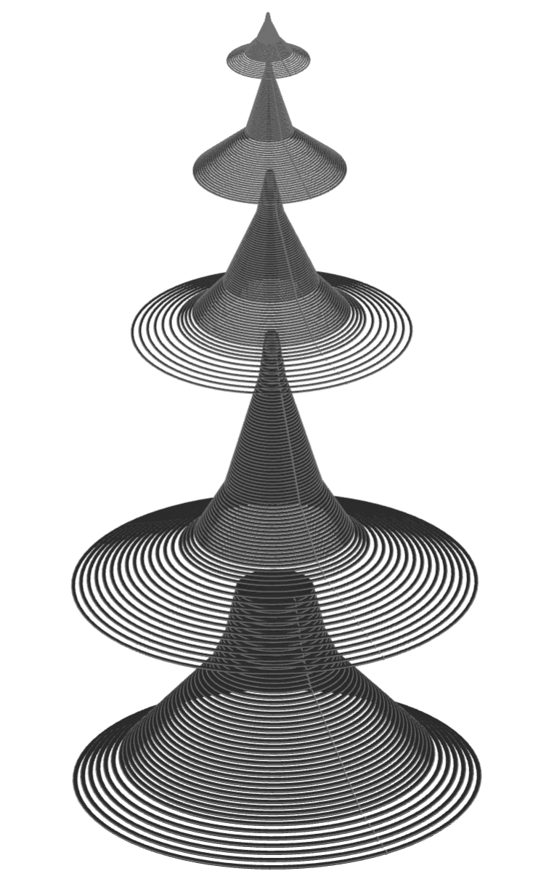

#############################
o_rings - parametric O-rings
#############################

O-rings are toroidal elastomeric seals installed in a gland and compressed
between mating components to prevent fluid or gas leakage. The ``o_rings`` module
creates nominal O-ring geometry and provides profiles for corresponding static and
dynamic glands.

The O-ring dimensions are the general-industrial Class A dimensions from
`ISO 3601-1 <https://www.iso.org/standard/58043.html>`_. Gland dimensions are
initial design recommendations from the
`Apple Rubber Seal Design Guide
<https://www.applerubber.com/seal-design-guide/seal-types-and-gland-design/o-ring-installation/>`_
and have not been verified against ISO 3601-2.

Creating O-Rings
================

An O-ring is selected by its three-digit ISO 3601 size code. A leading hyphen and
omitted leading zeroes are accepted and normalized:

.. code-block:: python

    from bd_warehouse.o_rings import ORing

    seal = ORing("025")
    equivalent_seal = ORing("-25")

The generated torus uses the nominal inside diameter and cross-section diameter.
Dimensional tolerances are available as attributes but are not applied to the CAD
geometry.

.. py:module:: o_rings

.. autoclass:: ORing

Size Data
=========

The available standards, size codes, and evaluated dimensions can be inspected
without creating geometry:

.. code-block:: python

    standards = ORing.types()
    sizes = ORing.sizes("iso3601")
    dimensions = ORing.parameters("025")
    alternatives = ORing.select_by_size("025")

For size ``025``, ``parameters`` returns the nominal inside diameter ``id``,
cross-section diameter ``w``, and their symmetric tolerances:

.. code-block:: python

    {
        "id": 29.87,
        "w": 1.78,
        "id_tol": 0.28,
        "w_tol": 0.08,
    }

.. automethod:: ORing.types
.. automethod:: ORing.sizes
.. automethod:: ORing.parameters
.. automethod:: ORing.select_by_size
.. automethod:: ORing.nominal_widths

Selecting By Diameter
=====================

``select_by_inner_diameter`` finds the nearest smaller and larger O-ring in each
cross-section family within the requested fractional tolerance:

.. code-block:: python

    matches = ORing.select_by_inner_diameter(650)

    # {
    #     "5.33": ("394", "395"),
    #     "6.99": ("474", "475"),
    # }

The dictionary keys are cross-section diameters. Each value is a
``(smaller, larger)`` pair; an exact match is returned as a one-item tuple.

.. automethod:: ORing.select_by_inner_diameter

Selecting By Installed Length
=============================

For a non-circular gland or a known piston-groove path, ``select_by_length`` finds
O-rings by their free centre-line length. A typical piston or male-gland design
targets approximately 2% installed stretch. The usual range is 1% to 5%, with 5%
treated as an upper limit rather than a target. Rotary shaft seals generally require
no installed stretch.

The lower candidate in each result pair will be stretched on the target path. Its
installed stretch is:

.. math::

    \text{stretch} = \frac{\text{installed length}}
                          {\text{free O-ring length}} - 1

For example, size ``025`` is stretched approximately 2% on a 101.42 mm path:

.. code-block:: python

    installed_length = 101.42
    matches = ORing.select_by_length(installed_length)
    candidate = ORing(matches["1.78"][0])
    stretch = installed_length / candidate.length - 1

Stretch reduces the O-ring cross-section, which should be considered when checking
gland squeeze and fill.

.. automethod:: ORing.select_by_length

Gland Profiles
==============

The recommended gland width can be queried directly from an O-ring cross-section
without constructing an ``ORing`` instance. Static and dynamic applications use
different tables, and the optional backing-ring count is included in the lookup:

.. code-block:: python

    static_width = ORing.gland_width_for(2.62)
    dynamic_width = ORing.gland_width_for(
        2.62,
        application="dynamic",
        number_backing_rings=1,
    )

.. automethod:: ORing.gland_width_for

The gland helpers return a build123d ``Sketch`` in the XY plane. The gland opening
lies on the local X axis and its depth extends in the negative Y direction. The
profile can be positioned and used with normal build123d operations to create a
linear or revolved gland cutter.

Static Glands
-------------

Static glands can be generated for axial or radial squeeze. The optional backing-ring
count widens the gland where the published data supports that combination:

.. code-block:: python

    seal = ORing("025")
    axial_profile = seal.static_gland_profile(axial=True)
    radial_profile = seal.static_gland_profile(
        axial=False,
        number_backing_rings=1,
    )

.. automethod:: ORing.static_gland_profile

Dynamic Glands
--------------

Dynamic profiles are intended for reciprocating or oscillating radial seals. They
use less squeeze than static glands to limit friction and wear:

.. code-block:: python

    seal = ORing("025")
    dynamic_profile = seal.dynamic_gland_profile()

.. automethod:: ORing.dynamic_gland_profile

After either gland method is called, the selected nominal dimensions and tolerances
are available through ``gland_width``, ``gland_width_tol``, ``gland_depth``,
``gland_depth_tol``, ``gland_radius``, and ``gland_radius_tol``. Gland design also
depends on seal material, hardness, pressure, temperature, lubrication, surface
finish, stretch, clearance, and allowable gland fill.
