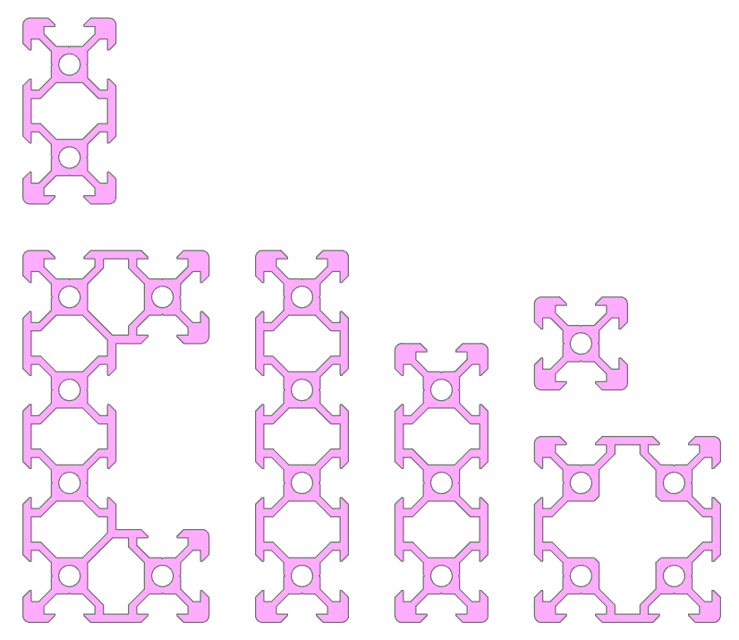
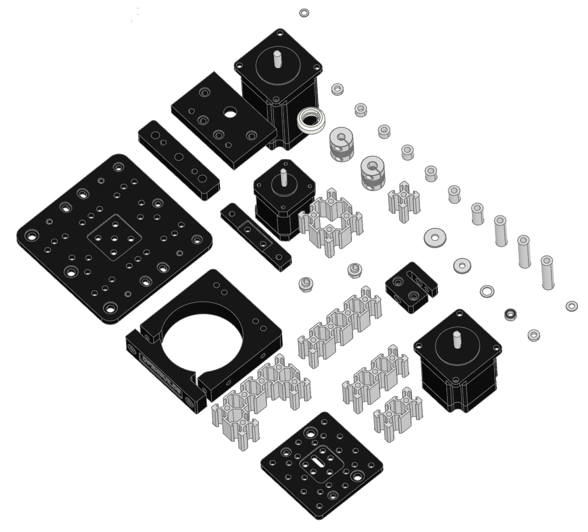
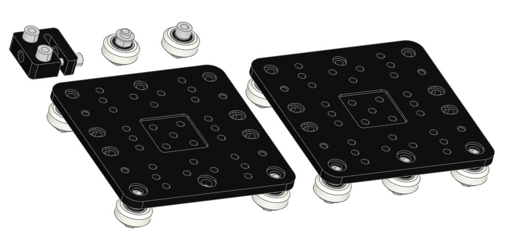

#########################################
open_builds - parametric OpenBuilds parts
#########################################
OpenBuilds is a comprehensive online platform for makers and DIY enthusiasts focused on 
building custom machines. The site offers a wide range of resources including detailed 
build guides for CNC machines, 3D printers, laser cutters, and more. Users can share 
their projects, access forums for community support, and find software tools like 
OpenBuilds CAM and CONTROL for machine operation. Additionally, there is a part store 
for sourcing components and a gallery showcasing completed builds. The site encourages 
collaboration and innovation within the maker community.

For more information, visit `OpenBuilds <https://openbuilds.com/>`_.

.. image:: assets/openbuilds.png

.. py:module:: open_builds

.. note:: All Joints are currently experimental and subject to change

***********
CAD Objects
***********

The following rail profiles can be used to create custom extrusions.

.. autoclass:: CBeamLinearRailProfile
.. autoclass:: VSlotLinearRailProfile

*****
Parts
*****

Parts available in the OpenBuilds part store:

.. autoclass:: AcmeAntiBacklashNutBlock8mm
.. autoclass:: AluminumSpacer
.. autoclass:: CBeamEndMount
.. autoclass:: CBeamLinearRail
.. autoclass:: CBeamGantryPlate
.. autoclass:: CBeamGantryPlateXLarge
.. autoclass:: CBeamRiserPlate
.. autoclass:: EccentricSpacer
.. autoclass:: FlexibleCoupler
.. autoclass:: LockCollar
.. autoclass:: fastener.LowProfileScrew
    :noindex:
.. autoclass:: MetricLeadScrew
.. autoclass:: RouterSpindleMount
.. autoclass:: ShimWasher
.. autoclass:: bearing.SingleRowCappedDeepGrooveBallBearing
    :noindex:
.. autoclass:: SpacerBlock
.. autoclass:: StepperMotor
.. autoclass:: VSlotLinearRail
.. autoclass:: XtremeSolidVWheel

**********
Assemblies
**********

Part assemblies available to be combined into custom machines.

.. autoclass:: AcmeAntiBacklashNutBlock8mmAssembly
.. autoclass:: XLargeCBeamGantry
.. autoclass:: XtremeSolidVWheelAssembly
