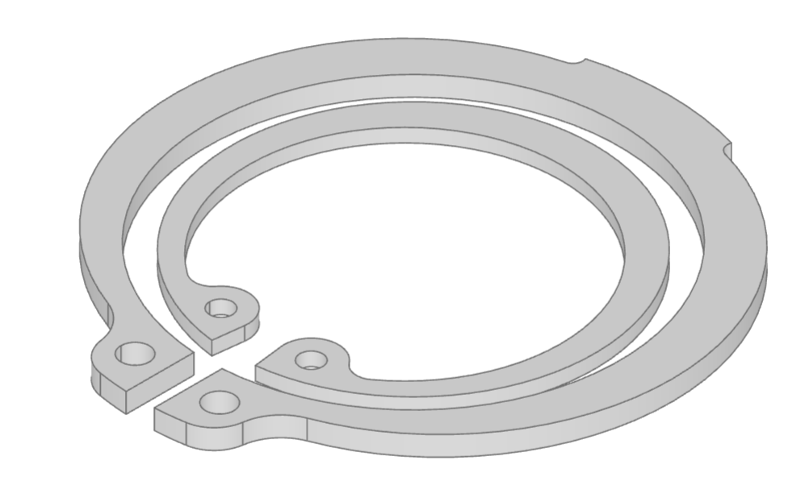

#############################################
retaining_ring - parametric retaining rings
#############################################

Retaining rings, also known as snap rings or circlips, locate components axially
on shafts or within bores. The ``retaining_ring`` module provides rings and matching
groove cutters based on the following standards:

* DIN 471 external retaining rings for shafts
* DIN 472 internal retaining rings for bores

The ring dimensions and groove dimensions are read from the standard tables included
with bd_warehouse.

Creating Retaining Rings
========================

The nominal ``size`` is the shaft diameter for an external ring and the bore diameter
for an internal ring. For example:

.. code-block:: python

    from bd_warehouse.retaining_ring import ExternalSnapRing, InternalSnapRing

    shaft_ring = ExternalSnapRing("20")
    bore_ring = InternalSnapRing("20")

By default, a ring is centered on the Z axis with its minimum Z face on the placement
plane. This makes either face of a retained component a convenient positioning datum.
Use ``align=Align.CENTER`` when the ring's mid-plane should be the datum instead.

.. py:module:: retaining_ring

RetainingRing
-------------

``RetainingRing`` is the common base class for the standardized ring objects.

.. autoclass:: RetainingRing

The available sizes and their tabulated parameters can be inspected without creating
CAD geometry:

.. code-block:: python

    from bd_warehouse.retaining_ring import ExternalSnapRing, RetainingRing

    external_sizes = ExternalSnapRing.sizes()
    dimensions = ExternalSnapRing.parameters("20")
    alternatives = RetainingRing.select_by_size("20")

.. automethod:: RetainingRing.sizes
.. automethod:: RetainingRing.parameters
.. automethod:: RetainingRing.select_by_size

ExternalSnapRing
----------------

``ExternalSnapRing`` creates DIN 471 retaining rings for installation in grooves on
shafts.

.. autoclass:: ExternalSnapRing

InternalSnapRing
----------------

``InternalSnapRing`` creates DIN 472 retaining rings for installation in grooves
inside bores.

.. autoclass:: InternalSnapRing

Retaining Ring Grooves
======================

``RetainingRingGroove`` creates the groove required by a supplied ring. It uses the
tabulated nominal groove diameter ``d2`` and groove width ``m``. The ``d4`` clearance
diameter extends the cutter beyond the shaft or bore surface to ensure reliable Boolean
overlap.

Like the rings, the cutter starts at Z=0 by default and extends in the positive Z
direction. The following example cuts a DIN 471 groove into a shaft:

.. code-block:: python

    from build123d import Align, BuildPart, Cylinder, Locations
    from bd_warehouse.retaining_ring import ExternalSnapRing, RetainingRingGroove

    ring = ExternalSnapRing("20")

    with BuildPart() as shaft:
        Cylinder(
            radius=10,
            height=40,
            align=(Align.CENTER, Align.CENTER, Align.MIN),
        )
        with Locations((0, 0, 15)):
            RetainingRingGroove(ring)

Passing an ``InternalSnapRing`` creates the corresponding outward-cutting DIN 472
groove for a bore. Use an alignment value such as ``Align.CENTER`` or
``(Align.CENTER, Align.CENTER, Align.MAX)`` when another axial datum is more convenient.

.. autoclass:: RetainingRingGroove
