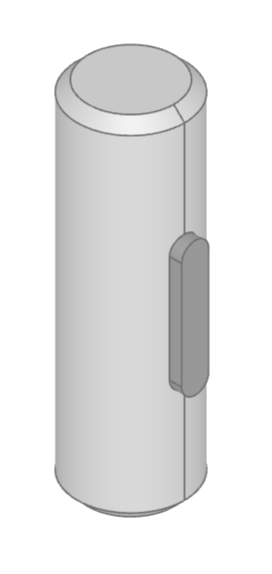

################################
shaft_key - keys and keyways
################################

Shaft keys transmit torque between a shaft and a mounted component such as a gear,
pulley, or coupling. The key occupies matching longitudinal recesses in the shaft and
hub so that the components rotate together.

The ``shaft_key`` module initially provides DIN 6885-1 parallel keys and matching
shaft or hub keyway cutters. Its dimensional data covers the nominal shaft diameters
from 6 mm through 50 mm listed in the available DIN 6885-1 extract.

Creating Parallel Keys
======================

DIN 6885-1 selects the nominal key width and height from the shaft diameter. Key
length depends on the hub length and required torque capacity, so it is supplied
explicitly. ``shaft_diameter`` may be an integer or an integer-valued float, and
must correspond to one of the millimetre sizes returned by ``ShaftKey.sizes()``:

.. code-block:: python

    from bd_warehouse.shaft_key import ShaftKey

    key = ShaftKey(
        shaft_diameter=25,
        length=40,
        key_form="A",
    )

Form A has two rounded ends and Form B has two square ends. The key is centered in
XY, extends along the X axis, and has its minimum Z face on the placement plane.

The current implementation accepts any positive length greater than or equal to the
key width. It does not yet validate the requested length against the DIN preferred-
length series. Key length should be verified for shear and bearing pressure; DIN 6892
covers calculation and design of parallel-key connections.

.. py:module:: shaft_key

ShaftKey
--------

``ShaftKey`` creates DIN 6885-1 Form A or Form B parallel-key geometry.

.. autoclass:: ShaftKey

The available shaft diameters and their nominal parameters can be inspected without
creating geometry:

.. code-block:: python

    sizes = ShaftKey.sizes()
    dimensions = ShaftKey.parameters(25)
    alternatives = ShaftKey.select_by_size(25)

.. automethod:: ShaftKey.sizes
.. automethod:: ShaftKey.parameters
.. automethod:: ShaftKey.select_by_size

Keyways
=======

``Keyway`` creates a nominal cutter from a supplied ``ShaftKey``. A shaft cutter
uses the tabulated shaft-keyseat depth ``t4``; a hub cutter uses the tabulated hub-
keyway depth ``t2``. The default placement assumes that the shaft or bore is
centered on Axis.Z. The keyway length is centered on Z and its radial face is placed
at the nominal shaft radius on positive X. A shaft keyway extends inward while a hub
keyway extends outward.

The following example cuts a Form A keyseat into a 25 mm shaft aligned with Axis.Z:

.. code-block:: python

    from build123d import Align, BuildPart, Cylinder
    from bd_warehouse.shaft_key import Keyway, ShaftKey

    key = ShaftKey(shaft_diameter=25, length=20, key_form="A")

    with BuildPart() as shaft:
        Cylinder(radius=12.5, height=40, align=(Align.CENTER, Align.CENTER, Align.CENTER))
        Keyway(key, keyway_type="shaft", fit="Loose")

.. autoclass:: Keyway

Broached Hub Keyways
====================

``Keyway.broach_profile()`` returns the transverse rectangular profile needed to
broach a keyway through a gear, pulley, or other hub. It is available for hub
keyways only:

.. code-block:: python

    key = ShaftKey(shaft_diameter=25, length=20)
    hub_keyway = Keyway(key, keyway_type="hub", fit="Loose")
    profile = hub_keyway.broach_profile()

The profile lies on the XY plane and starts at the shaft axis, ``X=0``. It extends
through the nominal bore radius and a further DIN ``t2`` depth in the positive X
direction. Its ISO-derived width is centered on Y. Extrude the profile directly
along Axis.Z through the hub thickness; no radial positioning calculation is
required.

.. automethod:: Keyway.broach_profile

Keyway Fits
===========

DIN 6885-1 specifies different ISO 286 width-tolerance classes for the shaft and hub
keyways:

.. list-table:: Keyway width tolerance classes
    :header-rows: 1

    * - Fit
      - Hub keyway
      - Shaft keyway
    * - Tight
      - P9
      - P9
    * - Loose
      - JS9
      - N9
    * - Sliding
      - D10
      - H9

Users select the descriptive ``fit`` value; no knowledge of the ISO designation is
required. The corresponding designation remains available as
``Keyway.width_tolerance``. Numerical ISO 286-1 limit deviations are exposed as
``Keyway.min_width`` and ``Keyway.max_width``. The cutter is modeled at the midpoint
of those limits, available as ``Keyway.width``, while ``Keyway.nominal_width``
retains the tabulated DIN key width.
