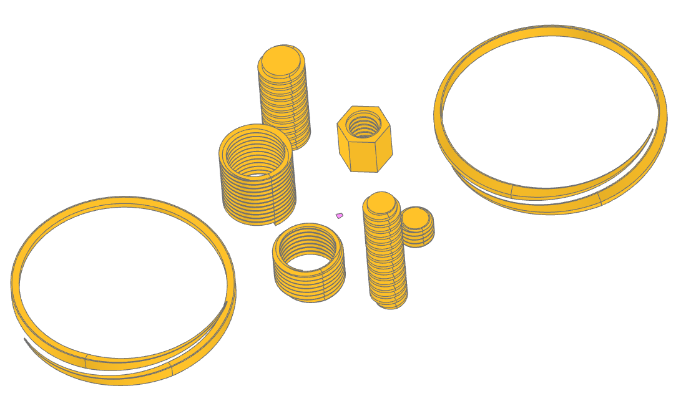
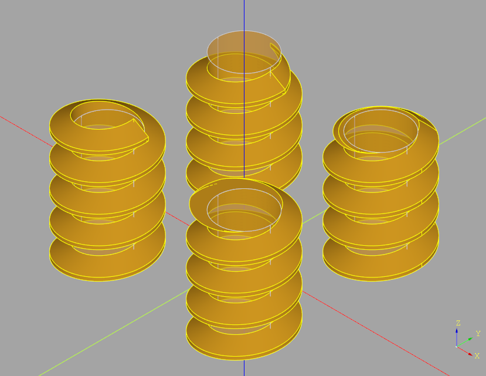

###################################
thread - parametric helical threads
###################################

Helical threads are very common in mechanical designs but can be tricky to
create in a robust and efficient manner. This sub-package provides classes that
create several common types of threads:

* ISO Standard 60° threads found on most fasteners
* Whitworth 55° threads with rounded crests and roots
* ISO 228 BSPP (G-series) parallel pipe threads
* Acme 29° threads found on imperial machine equipment
* Metric Trapezoidal 30° thread found on metric machine equipment

In addition, all threads support four different end finishes:

* "raw" - where the thread extends beyond the desired length ready for integration into another part
* "fade" - where the end of the thread spirals in - or out for internal threads
* "square" - where the end of the thread is flat
* "chamfer" - where the end of the thread is chamfered as commonly found on machine screws

Here is what they look like (clockwise from the top: "fade", "chamfer", "square" and "raw"):

When choosing between these four options, consider the performance differences
between them. Here are some measurements that give a sense of the relative
performance:

+-----------+--------+
| Finish    | Time   |
+===========+========+
| "raw"     | 0.018s |
+-----------+--------+
| "fade"    | 0.087s |
+-----------+--------+
| "square"  | 0.370s |
+-----------+--------+
| "chamfer" | 1.641s |
+-----------+--------+

The "raw" and "fade" end finishes do not use any boolean operations which is why
they are so fast. "square" does a cut() operation with a box while "chamfer"
does an intersection() with a chamfered cylinder.

The following sections describe the different thread classes.

******
Thread
******

.. autoclass:: thread.Thread

*********
IsoThread
*********

.. autoclass:: thread.IsoThread

***************
WhitworthThread
***************

.. autoclass:: thread.WhitworthThread

**********
BSPPThread
**********

.. autoclass:: thread.BSPPThread

**********
AcmeThread
**********

.. autoclass:: thread.AcmeThread

***********************
MetricTrapezoidalThread
***********************

.. autoclass:: thread.MetricTrapezoidalThread

*****************
TrapezoidalThread
*****************
The base class of the AcmeThread and MetricTrapezoidalThread classes.

.. autoclass:: thread.TrapezoidalThread

*******************
PlasticBottleThread
*******************

.. autoclass:: thread.PlasticBottleThread
    :members: identify, sizes, bottle_types

Bottles are not marked with their thread, and the name of a finish follows the
diameter over its thread crests rather than the neck's, so ``identify`` finds
the standard threads that fit measurements taken off a bottle:

.. code-block:: python

    >>> for match in PlasticBottleThread.identify(neck_diameter=30, pitch=4, turns=1.5):
    ...     print(match.size, match.major_diameter, match.min_turns)
    M33SP400 (31.52, 32.13) 1.0
    M33SP444 (31.52, 32.13) 1.125
    M33SP100 (31.52, 32.13) 1.125

.. autoclass:: thread.PlasticBottleThreadMatch
